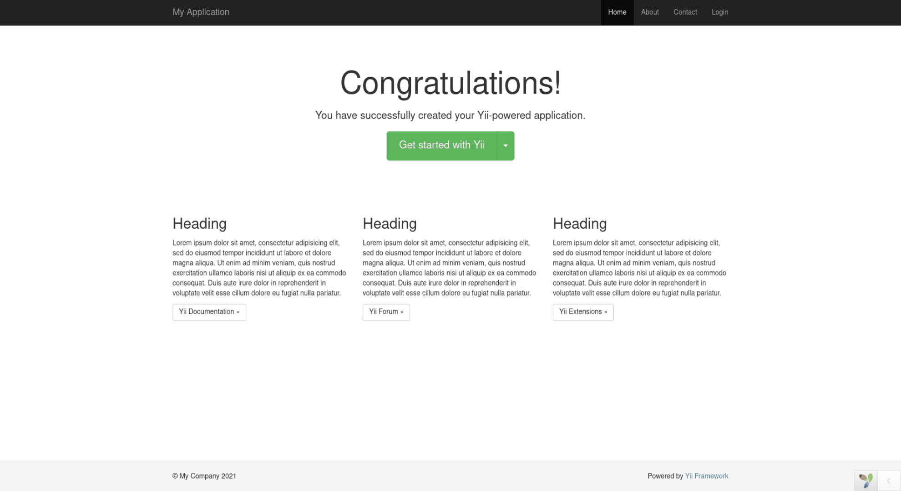

Dropdown button - Dynamic change actions for Yii PHP Framework
==============================================================
Dropdown button - Dynamic change actions for Yii PHP Framework

Installation
------------

The preferred way to install this extension is through [composer](http://getcomposer.org/download/).

Either run

```shell
composer require thtmorais/yii2-dropdown "*"
```

or add

```json
"thtmorais/yii2-dropdown": "*"
```

to the require section of your `composer.json` file.


Usage
-----

Once the extension is installed, simply use it in your code by  :

```php
<?= Dropdown::widget([
    'dropdownToggleClass' => 'btn btn-lg btn-success',
    'main' => [
        'id' => 'getStartedWithYii',
        'href' => 'http://www.yiiframework.com/',
        'class' => 'btn btn-lg btn-success',
        'text' => 'Get started with Yii'
    ],
    'subordinate' => [
        [
            'id' => 'yiiDocumentation',
            'href' => 'http://www.yiiframework.com/doc/',
            'text' => 'Yii Documentation'
        ],
        [
            'id' => 'yiiForum',
            'href' => 'http://www.yiiframework.com/forum/',
            'text' => 'Yii Forum'
        ],
        [
            'id' => 'yiiExtensions',
            'href' => 'http://www.yiiframework.com/extensions/',
            'text' => 'Yii Extensions'
        ]
    ]
]) ?>
```

Example being executed
-----

